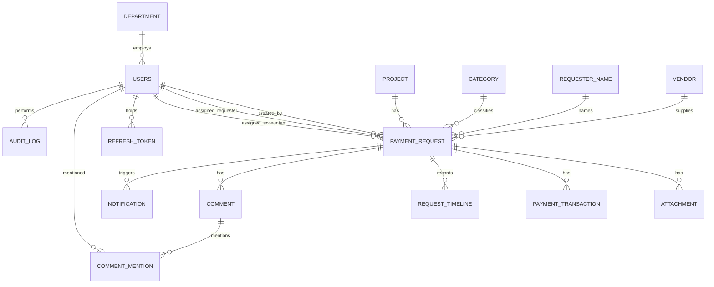

# LƯỢC ĐỒ CƠ SỞ DỮ LIỆU (v3.4)

> **Nguồn chuẩn:** [`docs/workflow.md`](workflow.md) · Tổng quan: [doc.md](doc.md)
> **File thật:** [`apps/api/prisma/schema.prisma`](../apps/api/prisma/schema.prisma) — khi tài liệu này và schema lệch nhau, **schema thắng**.
> PostgreSQL 18, Prisma 5. Dựng bằng `npm run db:push` rồi `npm run db:seed` trong `apps/api`.

---

## 1. Sơ đồ quan hệ

---

## 2. Quy ước chung

1. Khóa chính `uuid`, sinh bằng `gen_random_uuid()`.
2. Tiền dùng `NUMERIC(18,2)`; **cấm** kiểu dấu phẩy động.
3. `payment_requests.version` là khóa lạc quan: mọi transition kiểm tra và tăng trong cùng transaction.
4. `ON DELETE RESTRICT` cho các quan hệ tham chiếu người dùng và danh mục; `CASCADE` cho dữ liệu con của phiếu.
5. Danh mục xóa mềm (`deleted`) để giữ tên trên phiếu cũ.

---

## 3. Bảng chính

### 3.1. `departments` — cố định 4 dòng
| Cột | Kiểu | Ghi chú |
| :-- | :-- | :-- |
| id | uuid PK | |
| code | varchar UNIQUE | CU, LD, TC, KT |
| name | varchar | Admin đổi được |
| kind | enum UNIQUE | `PROCUREMENT`, `BOARD`, `FINANCE`, `ACCOUNTING` — mỗi loại đúng 1 dòng |

Chỉ cho `UPDATE code, name`; không thêm, không xóa, không đổi `kind`.

### 3.2. `users`
| Cột | Kiểu | Ghi chú |
| :-- | :-- | :-- |
| id | uuid PK | |
| username | varchar UNIQUE | Đăng nhập, so sánh không phân biệt hoa thường |
| full_name | varchar | |
| password_hash | varchar | argon2id |
| must_change_password | boolean | `true` khi tạo mới hoặc Admin reset |
| role | enum | `REQUESTER`, `LEADER`, `FINANCE_MANAGER`, `ACCOUNTANT`, `ADMIN` |
| department_id | uuid FK NULL | Tự theo `role`; `NULL` với ADMIN |
| status | enum | `ACTIVE`, `LOCKED` |
| failed_login_count | int | Reset khi đăng nhập thành công |
| locked_until | timestamptz NULL | Khóa tạm sau N lần sai |

Bất biến (kiểm tra ở tầng service): mỗi `role` nghiệp vụ chỉ 1 tài khoản `ACTIVE`; luôn còn ≥ 1 ADMIN `ACTIVE`.

### 3.3. `payment_requests`
| Cột | Kiểu | Ghi chú |
| :-- | :-- | :-- |
| id | uuid PK | |
| code | varchar UNIQUE | `PYC-YYYYMM-NNNN`, cấp qua `request_sequences` |
| status | enum | 11 giá trị B1→B8 + COMPLETED/CANCELLED/REJECTED. **Không có** `AUTO_VERIFY` |
| version | int | Khóa lạc quan |
| created_by / created_by_role | uuid FK / enum | Dùng cho luật tự duyệt ở B2 |
| assigned_requester_id | uuid FK | Mặc định = người tạo; đổi qua A4 |
| assigned_accountant_id | uuid FK NULL | Hệ thống tự gán ở T7 |
| project_id / category_id / requester_name_id / vendor_id | uuid FK | Master data |
| title / note | text | |
| has_invoice | boolean | Thay bảng loại chi; quyết định nhánh AUTO_VERIFY |
| requested_amount | numeric(18,2) | > 0 |
| advance_amount | numeric(18,2) NULL | 0 < x ≤ requested_amount |
| settlement_amount | numeric(18,2) NULL | ≥ advance_amount |
| priority | enum NULL | `HIGH`, `MEDIUM`, `LOW` — chọn ở B4 |
| invoice_due_start_at | timestamptz NULL | Mốc đếm hạn B8 |
| late_invoice | boolean | Cờ trễ hạn; **không** đổi trạng thái |
| last_late_reminder_on | varchar NULL | Chặn nhắc trùng trong ngày |
| resubmitted | boolean | Bị trả lại (T5) hoặc Admin mở lại (A3) |

Index: `status`, `(assigned_requester_id, status)`, `(assigned_accountant_id, status)`.

### 3.4. `attachments`
| Cột | Kiểu | Ghi chú |
| :-- | :-- | :-- |
| slot | enum | 9 ô: `REQUEST_FORM`, `QUOTATION_COMPARISON`, `PURCHASE_ORDER`, `ADVANCE_REQUEST`, `ADVANCE_PROOF`, `DELIVERY_RECORD`, `PAYMENT_REQUEST_DOC`, `INVOICE`, `FINAL_PROOF` |
| stage | enum | Trạng thái phiếu lúc tải lên — dùng để khóa file theo bước |
| folder | enum | `CUNG_UNG` hoặc `KE_TOAN` |
| file_name | varchar | Đã chuẩn hóa, trùng tên thì thêm `_{HHmmss}` |
| storage_path | varchar UNIQUE | `/CHUNG_TU/{folder}/{YYYY-MM-DD}/{code}/{file_name}` |
| size / mime_type / uploaded_by / uploaded_at | | Tối đa 25 MB |

### 3.5. Các bảng còn lại

| Bảng | Vai trò |
| :-- | :-- |
| `payment_transactions` | Giao dịch chi: `ADVANCE` (B5), `FINAL` (B7); `method` CK/TM, `paid_date` |
| `request_timeline` | Mọi transition `CREATE`, `T1`–`T13`, `A1`–`A4`. **Lưu vĩnh viễn**, không bị dọn theo 6 ngày |
| `comments` + `comment_mentions` | Trao đổi trên phiếu và `@nhắc tên` |
| `notifications` | Thông báo in-app |
| `audit_log` | Append-only; job hằng ngày xóa bản ghi cũ hơn `audit_retention_days` (6) |
| `holidays` | Ngày nghỉ lễ, dùng đếm ngày làm việc của B8 |
| `system_config` | Một dòng khóa `SYSTEM`: hạn B8, số lần đăng nhập sai, thời gian khóa, dung lượng file, số ngày lưu nhật ký, whitelist định dạng |
| `request_sequences` | Bộ đếm `PYC-YYYYMM-NNNN` theo tháng |
| `refresh_tokens` | Lưu hash refresh token, có `revoked_at` để thu hồi khi khóa tài khoản hoặc đăng xuất |

---

## 4. Khác biệt so với v2.6

Các bảng sau **đã bỏ**: `organizations`, `roles`, `user_roles` (N–N), `expense_types`, `document_types`, `payment_request_items`, `workflow_instances`, `workflow_tasks`, `workflow_action_history`.

Thay bằng: `role` là enum trên `users`, `has_invoice` là boolean trên phiếu, `request_timeline` thay cho cặp workflow_instance/task, 4 phòng ban cố định thay cho cây phòng ban của tổ chức.
