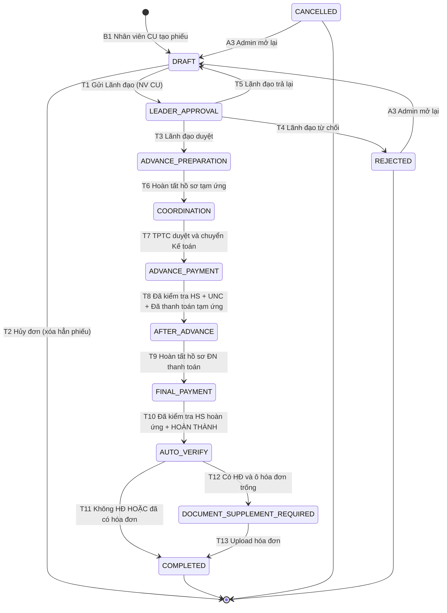

# WORKFLOW – HỆ THỐNG PHIẾU YÊU CẦU CHI (v3.4)

> Tổng hợp toàn bộ nghiệp vụ đã thống nhất: luồng vận hành, ma trận chuyển trạng thái, phân quyền, giao diện từng phòng ban.
> Stack: React · Node.js · PostgreSQL. Mọi thay đổi trạng thái là một transition FSM ở mục 4.
> Luồng vận hành: **1. Cung Ứng → 2. Lãnh Đạo → 3. Trưởng Phòng Tài Chính → 4. Kế Toán → 5. Admin (quản trị).**

---

## 1. Nguyên tắc vận hành cốt lõi

1. **Đi đủ trình tự B1 → B8, không bỏ bước, không đi tắt.** Mỗi ô ☑ là một chốt chuyển bước. Sau khi Lãnh đạo duyệt ở B2, không phòng ban nào được hủy/cancel phiếu; chỉ Lãnh đạo có quyền Phê duyệt, Từ chối (ghi lý do) và Trả lại.
2. **Checkpoint bắt buộc:** phiếu chỉ chuyển bước khi người phụ trách tick đúng ô ☑ và hệ thống xác thực đủ field, file bắt buộc. Chưa tick thì bộ phận kế tiếp không thấy phiếu. Tick là thao tác không hoàn tác (chỉ Admin mở lại).
3. **TPTC duyệt và chuyển phiếu cho Kế Toán (B4).**
4. **Thanh toán không chờ hóa đơn:** tại B7 chi dứt điểm phần còn lại kể cả khi chưa có hóa đơn; phiếu "Có hóa đơn" mà thiếu hóa đơn tự vào B8.
5. **Cô lập trách nhiệm:** mỗi phiếu có đúng một nhân viên cung ứng phụ trách (`assigned_requester_id`) và một kế toán phụ trách (`assigned_accountant_id`).
6. **Trao đổi trên record:** thiếu sót ở bất kỳ bước nào thì comment trực tiếp và @ người phụ trách, không nhắn ngoài hệ thống.
7. **Mọi phòng ban thấy toàn bộ phiếu ở mọi trạng thái B1 → B8** (kể cả DRAFT) qua màn hình Tra cứu, và **tải được mọi file đã đính kèm ở mọi bước** để đối chứng hồ sơ; nhưng chỉ xử lý được phiếu trong hàng đợi của mình.
8. **Super Admin:** toàn quyền, xoá được tất cả phiếu hoàn thành. Mọi thao tác đặc quyền buộc nhập lý do và ghi nhật ký.

---

## 2. Vai trò

| Mã | Vai trò | Phạm vi |
| :-- | :-- | :-- |
| REQUESTER | Nhân viên cung ứng | Tạo, nộp hồ sơ B1, B3, B6, B8 cho phiếu mình phụ trách |
| LEADER | Lãnh đạo | Duyệt B2 (mọi phiếu đã gửi lên) |
| FINANCE_MANAGER | Trưởng phòng Tài chính | Duyệt B4 và chuyển phiếu cho Kế toán |
| ACCOUNTANT | Nhân viên kế toán | Chi tạm ứng B5, thanh toán B7 cho phiếu được giao |
| ADMIN | Quản trị hệ thống | Toàn quyền A1–A4; quản trị người dùng, danh mục, cấu hình |

---

## 2b. Cơ cấu phòng ban (cố định 4 phòng)

| # | Phòng ban | Vai trò thuộc phòng |
| :-- | :-- | :-- |
| 1 | Phòng Cung Ứng | REQUESTER |
| 2 | Lãnh Đạo | LEADER |
| 3 | Phòng Tài Chính | FINANCE_MANAGER |
| 4 | Phòng Kế Toán | ACCOUNTANT |

- Phòng ban của tài khoản tự theo vai trò; Admin không thuộc phòng ban nào. Admin chỉ đổi được tên/mã phòng, không thêm, xóa hay đổi loại.
- **NV cung ứng gửi phiếu ở B1 là phiếu chuyển thẳng Lãnh Đạo (B2)**, không qua Lead của bộ phận nào và không định tuyến theo phòng ban. Mọi Lãnh đạo đang hoạt động đều thấy và duyệt được phiếu B2.

---

## 3. Trạng thái & View

| Bước | Trạng thái | Tên hiển thị | View | Người xử lý |
| :-- | :-- | :-- | :-- | :-- |
| B1 | DRAFT | Tạo phiếu mới | View Tổng hợp | NV cung ứng, Admin |
| B2 | LEADER_APPROVAL | Chờ Lãnh đạo duyệt | View Lãnh đạo duyệt | Lãnh đạo, Admin |
| B3 | ADVANCE_PREPARATION | Nộp hồ sơ tạm ứng | View Tổng hợp | NV cung ứng, Admin |
| B4 | COORDINATION | Chờ TPTC duyệt | View Chờ TPTC duyệt | TPTC, Admin |
| B5 | ADVANCE_PAYMENT | PKT tạm ứng | View PKT tạm ứng | Kế toán được giao, Admin |
| B6 | AFTER_ADVANCE | Theo dõi sau tạm ứng | View Theo dõi sau tạm ứng | NV cung ứng, Admin |
| B7 | FINAL_PAYMENT | PKT thanh toán | View PKT thanh toán | Kế toán phụ trách, Admin |
| — | AUTO_VERIFY | Kiểm tra tự động (không lưu) | — | Hệ thống |
| B8 | DOCUMENT_SUPPLEMENT_REQUIRED | Cần bổ sung hóa đơn | View Cần bổ sung hóa đơn | NV cung ứng, Admin |
| Kết thúc | COMPLETED | Hoàn thành | View Phiếu hoàn thành | Tất cả (chỉ xem), Admin |
| Kết thúc | CANCELLED | Đã hủy | Chi tiết phiếu | NV cung ứng (xem), Admin |
| Kết thúc | REJECTED | Bị từ chối | Chi tiết phiếu | NV cung ứng (xem), Admin |

---

## 4. Sơ đồ trạng thái (Mermaid)



Ghi chú: A1 (Force), A2 (Admin hủy), A4 (Chuyển giao NV CU) là thao tác đặc quyền hoặc không đổi trạng thái, không vẽ để sơ đồ gọn.

---

## 5. Ma trận chuyển trạng thái

### 5.1. Transition nghiệp vụ

| # | Từ | Hành động | Người thực hiện | Dữ liệu & điều kiện bắt buộc | Đến | Thông báo |
|--|--|--|--|--|--|--|
| T1 | B1 DRAFT | ☑ Gửi Lãnh đạo | NV cung ứng, Admin | Đủ field; Tổng tiền > 0; 2 file: Phiếu yêu cầu, Báo giá & bảng so sánh giá | B2 | Lãnh đạo |
| T2 | B1 DRAFT | Hủy đơn | NV cung ứng, Admin | Không cần nhập lý do; **xóa hẳn phiếu và tệp đính kèm**, không để lại bản ghi | (phiếu biến mất) | — |
| T3 | B2 LEADER_APPROVAL | ☑ Lãnh đạo duyệt | Lãnh đạo, Admin | Không tự duyệt phiếu mình tạo | B3 | NV cung ứng |
| T4 | B2 LEADER_APPROVAL | Từ chối | Lãnh đạo, Admin | Comment lý do | REJECTED | NV cung ứng |
| T5 | B2 LEADER_APPROVAL | Trả lại | Lãnh đạo, Admin | Comment nội dung cần bổ sung | B1 | NV cung ứng |
| T6 | B3 ADVANCE_PREPARATION | ☑ Hoàn tất HS tạm ứng | NV cung ứng, Admin | 0 < Tạm ứng ≤ Tổng đề nghị; file Đơn đặt hàng, Đề nghị tạm ứng | B4 | TPTC |
| T7 | B4 COORDINATION | ☑ TPTC duyệt và chuyển Kế toán | TPTC, Admin | Tài khoản Kế toán đang hoạt động; Độ ưu tiên | B5 | Kế toán |
| T8 | B5 ADVANCE_PAYMENT | ☑ Đã KT HS + ☑ Đã thanh toán tạm ứng | Kế toán được giao, Admin | Chứng từ chi (UNC / Phiếu chi); ngày chi | B6 | NV cung ứng |
| T9 | B6 AFTER_ADVANCE | ☑ Hoàn tất HS ĐN thanh toán | NV cung ứng, Admin | 0 ≤ Đã chi thêm ≤ Tổng đề nghị − Đã tạm ứng (vượt trần: báo lỗi ngay tại ô nhập, không cho gửi); file BNH, ĐNTT, Hóa đơn (nếu có) | B7 | Kế toán phụ trách |
| T10 | B7 FINAL_PAYMENT | ☑ Đã KT HS hoàn ứng + ☑ HOÀN THÀNH | Kế toán phụ trách, Admin | UNC đợt cuối nếu còn lại > 0; ngày chi | AUTO_VERIFY | — |
| T11 | AUTO_VERIFY | AUTO_PASS | Hệ thống | Loại chi = Không HĐ HOẶC đã có file hóa đơn | COMPLETED | NV cung ứng |
| T12 | AUTO_VERIFY | AUTO_REQUIRE_INVOICE | Hệ thống | Loại chi = Có HĐ VÀ ô hóa đơn trống | B8 | NV cung ứng (đếm 5 ngày làm việc) |
| T13 | B8 DOCUMENT_SUPPLEMENT_REQUIRED | Upload hóa đơn | NV cung ứng, Admin | File hóa đơn hợp lệ | COMPLETED | Kế toán phụ trách |

> T10 → T11/T12 chạy trong cùng một database transaction: không có phiếu nào dừng ở AUTO_VERIFY.
> Kế toán KHÔNG có nút trả lại. Thiếu sót ở B5/B7 xử lý bằng comment @ người tạo.
> **Chỉ Lãnh đạo có 3 thao tác Phê duyệt (T3) / Từ chối (T4, ghi lý do) / Trả lại (T5).** Không phòng ban nào khác có nút từ chối, trả lại hay hủy sau khi Lãnh đạo đã duyệt.

### 5.2. Thao tác không đổi trạng thái & đặc quyền

| # | Hành động | Áp dụng | Người thực hiện | Điều kiện | Kết quả |
|--|--|--|--|--|--|
| A1 | Ép chuyển bước | Mọi trạng thái, kể cả COMPLETED / CANCELLED / REJECTED | Admin | Lý do; hệ thống chỉ cảnh báo khi vượt bước chi tiền chưa có giao dịch, không chặn | Theo trạng thái chọn |
| A2 | Admin hủy phiếu | Mọi trạng thái | Admin | Lý do; hệ thống cảnh báo nếu phiếu đã phát sinh giao dịch chi, không chặn | CANCELLED |
| A3 | Mở lại phiếu | CANCELLED, REJECTED, COMPLETED | Admin | Lý do; giữ nguyên mã phiếu và lịch sử | B1 (hoặc bước Admin chọn) |
| A4 | Chuyển giao NV cung ứng | Mọi trạng thái | Admin | Người nhận là NV CU đang hoạt động | Đổi `assigned_requester_id`, trạng thái giữ nguyên |

> Admin (Super Admin) không bị chặn bởi trạng thái phiếu: mọi thao tác A1–A4, sửa dữ liệu, thay file, tick thay và xóa phiếu đều thực hiện được ở mọi trạng thái, bắt buộc nhập lý do và ghi nhật ký.

### 5.3. Quy trình TPTC duyệt và chuyển phiếu cho Kế toán (B4)

Hệ thống chỉ có **một luồng duyệt duy nhất**: TPTC tick duyệt ở B4 thì phiếu chuyển thẳng cho tài khoản Kế toán duy nhất của Phòng Kế Toán. Không có nhánh phân công nhiều người, không có điều hướng sang kế toán khác, không có cơ chế TPTC tự xử lý thay.

#### 5.3.1. Transition T7 (COORDINATION → ADVANCE_PAYMENT)
1. **Dữ liệu tại B4**:
   - `assigned_accountant_id` (hoặc `assignedUserId`): hệ thống **tự điền** ID của tài khoản Kế toán duy nhất đang hoạt động; TPTC không phải chọn người.
   - `priority`: Độ ưu tiên phiếu (`HIGH`, `MEDIUM`, `LOW`), dùng để sắp xếp thứ tự xử lý trong hàng đợi của Kế toán.
   - `note` / `coordinationNote`: Ghi chú điều phối (tùy chọn), tự động ghi nhận vào dòng trao đổi trên phiếu kèm tiền tố `[TÀI CHÍNH ĐIỀU PHỐI]`.
   - Checkpoint ☑ `TPTC duyệt và chuyển Kế toán` (bắt buộc tick).
2. **Quy tắc kiểm tra hợp lệ (Invariants & Validation)**:
   - Tài khoản Kế toán phải có trạng thái `ACTIVE` và vai trò `ACCOUNTANT`.
   - Không còn tài khoản Kế toán nào đang hoạt động thì chặn T7 và báo Admin.
3. **Cơ chế cập nhật Database & Workflow Task**:
   - Cập nhật aggregate root `payment_request.assigned_accountant_id = accountant_id`, `priority = selected_priority`.
   - Khởi tạo nhiệm vụ quy trình `workflow_task` tiếp theo (`ADVANCE_PAYMENT`) gán đích danh `assigned_user_id = accountant_id`.
   - Ghi nhật ký kiểm toán `audit_log` (`action: DISPATCH`) và lịch sử bước `workflow_action_history`.
   - Gửi thông báo tức thời (`PAYMENT_REQUEST_DISPATCHED`) vào tài khoản Kế toán: *"Phiếu PYC-xxx đã được chuyển cho bạn để thực hiện tạm ứng"*.
4. **Cô lập hàng đợi và quyền thực thi (Row-Level Security & Policy Guard)**:
   - Phiếu chuyển trạng thái sang `ADVANCE_PAYMENT` (B5) và xuất hiện ngay lập tức trong view "PKT tạm ứng B5" (`advancePayments` / `myPayments`) của tài khoản Kế toán.
   - Chính sách phân quyền Backend (`canPayAdvance`) chặn 403 Forbidden nếu bất kỳ ai ngoài Kế toán được giao (hoặc Admin) cố tình bấm chi tạm ứng.
   - Kế toán vắng mặt: Admin dùng đặc quyền A1 (ép chuyển bước) hoặc tick thay để phiếu không bị kẹt.

---

## 6. Ràng buộc nghiệp vụ

1. Mã phiếu tự sinh, duy nhất, không sửa (ví dụ `PYC-YYYYMM-0001`).
2. Số tiền: Tổng đề nghị > 0; 0 < Tạm ứng ≤ Tổng đề nghị. Ở B6 nhân viên cung ứng nhập **Đã chi thêm** (phần chi ngoài khoản đã tạm ứng), hệ thống tự tính **Còn lại phải chi = Tổng đề nghị − Đã chi thêm − Đã tạm ứng**. Trần của ô nhập là Tổng đề nghị − Đã tạm ứng; vượt trần thì **báo lỗi ngay tại ô nhập ở B6, không cho gửi** (không chuyển Admin), backend trả `ERR_SETTLE_OVER_BUDGET`. Nhập 0 là hợp lệ, nghĩa là không chi thêm đồng nào ngoài khoản tạm ứng. Trong database giá trị này vẫn nằm ở cột `settlement_amount` (giữ tên cũ để không phải đổi hợp đồng API).
3. Khóa hồ sơ theo bước: file và field chỉ sửa được khi phiếu đang ở đúng bước và chưa tick chốt; mở lại khi bị trả lại hoặc do Admin. Riêng file hóa đơn được bổ sung ở B6, B7, B8.
4. Trách nhiệm theo phòng ban: mỗi phòng ban chỉ có 1 người, phiếu do người của phòng ban đó tạo và chịu trách nhiệm trên form vận hành của phòng mình. Không áp dụng ràng buộc Tách biệt nhiệm vụ (SoD): hệ thống không chặn trường hợp người duyệt hoặc kế toán được giao trùng người tạo phiếu.
5. Hủy phiếu: **chỉ có ở B1** (NV cung ứng, không cần nhập lý do). Phiếu ở B1 chưa ai duyệt, chưa phát sinh tiền hay trách nhiệm, nên hủy là **xóa hẳn khỏi hệ thống** cùng mọi tệp đã đính kèm — không để lại phiếu "Đã hủy" làm rác hàng đợi. Nhật ký vẫn ghi để Admin tra được ai hủy. Trạng thái `CANCELLED` chỉ còn phát sinh từ đặc quyền A2 của Admin. Từ B2 trở đi, sau khi Lãnh đạo đã duyệt, không phòng ban nào được hủy hay cancel phiếu — phiếu đi đủ luồng B1 → B8. Chỉ Lãnh đạo có quyền Từ chối (bắt buộc ghi lý do), Trả lại và Phê duyệt. Đặc quyền A2 của Admin không nằm trong ràng buộc này.
6. B2 không định tuyến theo phòng ban: phiếu đi thẳng Lãnh Đạo, mọi Lãnh đạo đang hoạt động đều duyệt được. Hệ thống không còn tài khoản Lãnh đạo nào hoạt động thì chặn gửi B2 và báo Admin.
7. Quá hạn B8: scheduler chạy hằng ngày; quá 5 ngày làm việc gắn cờ trễ hạn (không đổi trạng thái), nhắc hằng ngày cho NV CU và kế toán phụ trách. Ngày làm việc theo lịch nghỉ lễ do Admin quản lý.
8. Độ ưu tiên chọn ở B4 dùng để sắp xếp hàng đợi B5, B7.
9. Chống xử lý trùng: mọi transition kiểm tra trạng thái hiện tại và cột `version` (optimistic locking) trong cùng transaction.

---

## 7. Phân quyền Work Queue (Row-Level Security)

`assigned_requester_id` mặc định = `created_by`, chỉ đổi khi chuyển giao (A4).

| View | Điều kiện lọc | Giám sát |
| :-- | :-- | :-- |
| Tổng hợp (B1, B3) | `assigned_requester_id = me AND status IN ('DRAFT','ADVANCE_PREPARATION')` | Admin |
| Lãnh đạo duyệt (B2) | `status = 'LEADER_APPROVAL'` (mọi Lãnh đạo) | Admin |
| Chờ TPTC duyệt (B4) | `status = 'COORDINATION'` (role TPTC) | Admin |
| PKT tạm ứng (B5) | `assigned_accountant_id = me AND status = 'ADVANCE_PAYMENT'` | TPTC, Admin |
| Theo dõi sau tạm ứng (B6) | `assigned_requester_id = me AND status = 'AFTER_ADVANCE'` | Admin |
| PKT thanh toán (B7) | `assigned_accountant_id = me AND status = 'FINAL_PAYMENT'` | TPTC, Admin |
| Cần bổ sung hóa đơn (B8) | `assigned_requester_id = me AND status = 'DOCUMENT_SUPPLEMENT_REQUIRED'` | Admin |
| Phiếu hoàn thành | `status = 'COMPLETED'` (chỉ xem, mọi người dùng) | Admin |
| Tra cứu hồ sơ | Mọi phiếu, mọi trạng thái B1 → B8 kể cả DRAFT, CANCELLED, REJECTED, COMPLETED (chỉ xem, tải mọi file đính kèm) | Mọi người dùng |

---

## 8. Master Data, tệp đính kèm, nhật ký

### 8.1. Master Data trên form B1
Áp dụng: Dự án, Hạng mục chi, Người yêu cầu, Nhà cung cấp. (Bỏ ô "Phòng ban yêu cầu" vì B2 không còn định tuyến theo phòng ban.)

| Danh mục | NV cung ứng | Admin | Lãnh đạo, TPTC, KT |
| :-- | :-- | :-- | :-- |
| Dự án, Hạng mục, Người yêu cầu, Nhà cung cấp | Thêm · Sửa · Xóa | Thêm · Sửa · Xóa | Chỉ đọc |
| Phòng ban (4 phòng cố định) | Chỉ đọc | Chỉ đổi tên | Chỉ đọc |

- Loại chi dùng checkbox "Có hóa đơn" (bỏ tick = Không hóa đơn), không có nút danh mục.
- Xóa là xóa mềm; không xóa được mục đang gắn với phiếu chưa kết thúc. Danh sách 4 phòng ban cố định (mục 2b), Admin chỉ đổi tên.

### 8.2. Ô đính kèm (dùng ở mọi form có file)
- Bốn thao tác: Tải lên (chọn / kéo thả) · Xem · Tải về · Xóa (xóa file sai rồi tải file mới). Mỗi ô nhận nhiều file.
- Mỗi file upload tối đa **25 MB**. Chỉ đính/xóa được khi phiếu đang ở đúng bước và chưa tick chốt. Xóa file ở ô bắt buộc mà chưa tải file mới → nút chốt báo thiếu, không cho chuyển bước.
- Toàn bộ file đính kèm của Cung ứng và Kế toán: mọi phòng ban đều Xem và Tải về được để đối chứng hồ sơ, **không xóa, không sửa**. Admin thao tác mọi bước, kể cả phiếu Hoàn thành (bắt buộc nhập lý do, ghi nhật ký). Kế toán chỉ upload chứng từ chi của mình, không sửa file của Cung ứng.

| Bước | Ô đính kèm | Bắt buộc |
| :-- | :-- | :-- |
| B1 | Phiếu yêu cầu · Báo giá & bảng so sánh giá | Đủ 2 |
| B3 | Đơn đặt hàng · Đề nghị tạm ứng | Đủ 2 |
| B5 | UNC / Phiếu chi | Có |
| B6 | BNH · ĐNTT · Hóa đơn | BNH, ĐNTT bắt buộc; Hóa đơn nếu có |
| B7 | UNC / Phiếu chi đợt cuối | Có, nếu còn tiền phải chi |
| B8 | Hóa đơn | Có |

### 8.3. Lưu trữ file

File do Cung ứng và Kế toán đính kèm được lưu theo cây thư mục:

```
CHUNG_TU/                              ← folder cha
├── CUNG_UNG/                          ← folder con 1
│   ├── 2026-09-28/                    ← folder ngày upload
│   │   ├── PYC-202609-0007/           ← folder mã phiếu
│   │   │   ├── file_1
│   │   │   └── file_2
│   │   └── PYC-202609-0008/
│   │       └── file_1
│   └── 2026-09-29/
│       └── ...
└── KE_TOAN/                           ← folder con 2
    ├── 2026-09-28/
    │   ├── PYC-202609-0007/
    │   │   ├── file_1
    │   │   └── file_2
    │   └── PYC-202609-0008/
    │       └── file_1
    └── 2026-09-29/
        └── ...
```

- Đường dẫn: `/CHUNG_TU/{CUNG_UNG|KE_TOAN}/{YYYY-MM-DD}/{MA_PHIEU}/{file_name}`.
- Không phân loại file theo định dạng: **bỏ hoàn toàn cơ chế tự phân loại `DOCUMENT/` và `IMAGE/`**; tài liệu và hình ảnh nằm chung trong folder mã phiếu.
- Folder con xác định theo phòng ban của người upload: file ở B1, B3, B6, B8 vào `CUNG_UNG/`; file ở B5, B7 vào `KE_TOAN/`.
- Folder ngày là **ngày upload thực tế**, tự tạo khi có file đầu tiên trong ngày.
- Folder mã phiếu tự tạo theo `payment_request.code` (ví dụ `PYC-202609-0007`). Một phiếu upload file ở nhiều ngày khác nhau thì có folder mã phiếu ở từng folder ngày tương ứng.
- Chuẩn hóa tên file (bỏ dấu, thay ký tự đặc biệt bằng `_`); trùng tên trong cùng folder mã phiếu thì thêm hậu tố `_{HHmmss}`.
- **Giới hạn dung lượng: tối đa 25 MB cho mỗi file upload**; file vượt 25 MB bị từ chối ngay tại bước chọn file, báo lỗi rõ dung lượng thực tế.
- Whitelist định dạng do Admin cấu hình.

### 8.4. Nhật ký
- Thao tác của mọi phòng ban ghi vào nhật ký. Mỗi người có tab Lịch sử xem thao tác của mình; Admin xem toàn hệ thống.
- Nhật ký lưu 6 ngày rồi tự xóa. Không ai sửa được nội dung nhật ký, kể cả Admin.
- Thông tin trên phiếu (người duyệt từng bước, lý do từ chối/trả lại, comment, file) là dữ liệu của phiếu, không bị xóa theo 6 ngày.

---

## 9. Giao diện theo phòng ban (menu)

| Vai trò | Menu |
| :-- | :-- |
| Nhân viên cung ứng | Tạo phiếu B1 · Phiếu của tôi · Hồ sơ tạm ứng B3 · Theo dõi sau tạm ứng B6 · Bổ sung hóa đơn B8 · Tra cứu hồ sơ · Lịch sử (6 ngày) |
| Lãnh đạo | Chờ tôi duyệt B2 · Tra cứu hồ sơ · Báo cáo · Lịch sử |
| Trưởng phòng Tài chính | Chờ TPTC duyệt B4 · Đang xử lý · Báo cáo · Tra cứu hồ sơ · Lịch sử |
| Nhân viên kế toán | PKT tạm ứng B5 · PKT thanh toán B7 · Theo dõi thiếu HĐ · Tra cứu hồ sơ · Lịch sử |
| Admin | Quản lý phiếu · Người dùng · Danh mục · Cấu hình · Nhật ký · Báo cáo |
| Dùng chung | Đăng nhập · Tra cứu hồ sơ · Chi tiết phiếu |

### 9.1. Quyền can thiệp phiếu của Admin theo trạng thái

| Thao tác | Đang xử lý (B1→B8) | Hủy / Từ chối | Hoàn thành |
| :-- | :-- | :-- | :-- |
| Xem, tải file | Được | Được | Được |
| Sửa dữ liệu, thay file | Được | Được | Được |
| Duyệt / tick thay | Được | Được | Được |
| Ép chuyển bước (A1) | Được | Được | Được |
| Chuyển giao (A4) | Được | Được | Được |
| Hủy phiếu (A2) | Được | Được | Được |
| Mở lại phiếu (A3) | — (phiếu chưa kết thúc) | Được | Được |
| Xóa phiếu | Được | Được | Được |

> Admin (Super Admin) toàn quyền ở mọi trạng thái, không có ngoại lệ theo trạng thái phiếu. Mọi thao tác đặc quyền bắt buộc nhập lý do và ghi nhật ký; hệ thống chỉ cảnh báo (không chặn) khi thao tác đụng tới phiếu đã phát sinh giao dịch chi.

---

## 10. Traceability (module & entity gợi ý)

| Bước | State | Module | Entity chính | Route | Actor |
| :-- | :-- | :-- | :-- | :-- | :-- |
| B1 | DRAFT | payment-requests | payment_request, master_data | /procurement/requests/new | REQUESTER |
| B2 | LEADER_APPROVAL | approvals | workflow_task | /approvals/leader | LEADER |
| B3 | ADVANCE_PREPARATION | documents | document | /procurement/overview | REQUESTER |
| B4 | COORDINATION | finance-coordination | user_assignment | /finance/coordination | FINANCE_MANAGER |
| B5 | ADVANCE_PAYMENT | accounting-payments | payment_transaction | /accounting/advance-payments | ACCOUNTANT |
| B6 | AFTER_ADVANCE | procurement-tracking | document | /procurement/after-advance | REQUESTER |
| B7 | FINAL_PAYMENT | accounting-payments | payment_transaction | /accounting/final-payments | ACCOUNTANT |
| B8 | DOCUMENT_SUPPLEMENT_REQUIRED | documents, scheduler | system_countdown | /procurement/supplement-invoice | REQUESTER |
| Kết thúc | COMPLETED | archive, reports | payment_request_archive | /reports/completed-requests | ALL (chỉ xem) |
| Phụ trợ | — | user-management | users, roles, departments | /admin/users | ADMIN |
| Phụ trợ | — | audit | audit_trail_log (6 ngày) | /history | ALL (theo phạm vi) |
| Phụ trợ | — | storage-engine | file_attachments | Backend API | ALL |

---

## 11. Xác thực & phân quyền (Authentication & Authorization)

### 11.1. Đăng nhập
- Đăng nhập bằng **tên tài khoản (username) do Admin cấp** + mật khẩu (không dùng email để đăng nhập).
- Username là duy nhất toàn hệ thống, không phân biệt hoa thường, không đổi sau khi tạo (Admin đổi được khi cần, ghi nhật ký).
- Mật khẩu lưu dạng **băm (bcrypt/argon2)**, không lưu bản rõ. Bắt buộc đổi mật khẩu ở lần đăng nhập đầu.
- Sai mật khẩu quá số lần cấu hình (mặc định 5) thì khóa tạm 15 phút. Mọi lần đăng nhập (thành công/thất bại) ghi nhật ký.
- Phiên đăng nhập dùng **JWT** (access token ngắn hạn + refresh token). Hết hạn phải đăng nhập lại. Có nút Đăng xuất; Admin khóa tài khoản thì phiên đang mở bị vô hiệu.

### 11.2. Mỗi tài khoản đúng 1 vai trò cố định
- Mỗi tài khoản gắn **đúng một vai trò**; phòng ban tự theo vai trò (mục 2b), Admin không thuộc phòng ban. Muốn đổi vai trò thì Admin sửa tài khoản (ghi nhật ký), không phải tạo mới.
- Lãnh đạo không có danh sách phòng ban quản lý: mọi Lãnh đạo duyệt được mọi phiếu B2.
- Bất biến: mỗi phòng ban chỉ có **đúng 1 tài khoản** (1 NV cung ứng, 1 Lãnh đạo, 1 TPTC, 1 Kế toán); hệ thống luôn còn ≥ 1 Admin đang hoạt động.

### 11.3. Bảng `users` (PostgreSQL gợi ý)

| Cột | Kiểu | Ghi chú |
| :-- | :-- | :-- |
| id | uuid PK | |
| username | varchar unique | Admin cấp, đăng nhập bằng cột này |
| full_name | varchar | |
| password_hash | varchar | bcrypt/argon2 |
| must_change_password | boolean | true khi tạo mới / reset |
| role | enum | REQUESTER, LEADER, FINANCE_MANAGER, ACCOUNTANT, ADMIN — cố định 1 giá trị |
| department_id | uuid FK → departments, NULL | tự theo vai trò; NULL với ADMIN |
| status | enum | ACTIVE, LOCKED |
| failed_login_count | int | reset khi đăng nhập thành công |
| created_by / created_at / updated_at | uuid / timestamptz | |

### 11.4. Phân quyền = Vai trò × Phạm vi dữ liệu
Quyền của mỗi người = **vai trò** (được làm hành động gì) giao với **phạm vi dữ liệu** (được đụng tới phiếu nào). Kiểm tra ở cả 2 tầng: giao diện ẩn nút không có quyền, backend từ chối request sai quyền (kể cả gọi API trực tiếp).

- **Phạm vi cá nhân:** `assigned_requester_id = me` hoặc `assigned_accountant_id = me`.
- **Phạm vi phòng ban:** TPTC thấy toàn bộ phiếu phía Kế toán; Lãnh đạo thấy mọi phiếu B2.
- **Phạm vi toàn hệ thống:** Admin.
- **Phạm vi chỉ đọc:** mọi người xem được toàn bộ phiếu ở mọi trạng thái B1 → B8 qua Tra cứu và tải được mọi file đính kèm của mọi bước, nhưng chỉ xử lý trong hàng đợi của mình.

### 11.5. Ma trận phân quyền theo phòng ban

Ký hiệu: **X** = làm được (trong phạm vi của mình) · **Xem** = chỉ xem/tải file · **–** = không có quyền.

| Hành động | NV cung ứng | Lãnh đạo | TPTC | NV kế toán | Admin |
| :-- | :-: | :-: | :-: | :-: | :-: |
| Tạo phiếu B1 | X | – | – | – | X |
| Hủy đơn B1 (không cần lý do) | X | – | – | – | X |
| Duyệt / Từ chối / Trả lại B2 | – | X | – | – | X |
| Nộp hồ sơ tạm ứng B3 | X | – | – | – | X |
| Duyệt & phân công B4 | – | – | X | – | X |
| Chi tạm ứng B5 | – | – | – | X | X |
| Nộp hồ sơ ĐN thanh toán B6 | X | – | – | – | X |
| Thanh toán B7 | – | – | – | X | X |
| Bổ sung hóa đơn B8 | X | – | – | – | X |
| Chuyển giao NV cung ứng A4 | – | – | – | – | X |
| Xem & tải hồ sơ mọi bước B1→B8 (Tra cứu) | Xem | Xem | Xem | Xem | Xem |
| Giám sát toàn phòng | – | Xem (mọi phiếu) | X (phòng KT) | – | X |
| Quản lý danh mục | Thêm/Sửa/Xóa¹ | – | – | – | X |
| Người dùng / Cấu hình / Nhật ký toàn hệ thống | – | – | – | – | X |
| Báo cáo | – | X | X | – | X |
| Ép chuyển / Hủy / Mở lại / Xóa phiếu (A1–A3) | – | – | – | – | X |

> ¹ Không gồm danh mục Phòng ban (chỉ Admin). Xóa là xóa mềm.
> Phiếu đã Hoàn thành: các vai trò nghiệp vụ chỉ Xem; Admin toàn quyền ở mọi trạng thái (sửa, tick thay, ép chuyển, hủy, mở lại, xóa), bắt buộc nhập lý do và ghi nhật ký.

### 11.6. Menu hiển thị theo vai trò
Sau khi đăng nhập, hệ thống đọc `role` để dựng thanh menu (danh sách menu từng vai trò ở mục 9). Người dùng không thấy và không truy cập được menu ngoài vai trò của mình; gõ thẳng URL của view khác cũng bị backend chặn.

---

